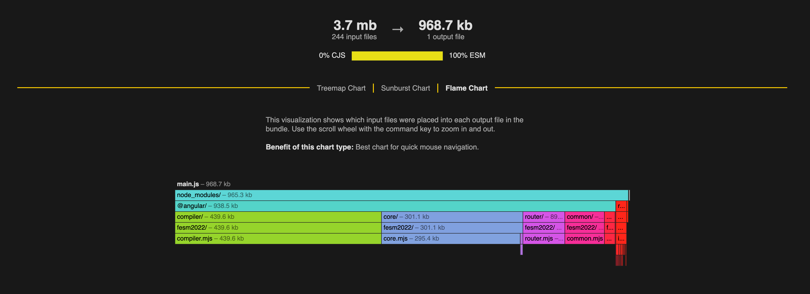
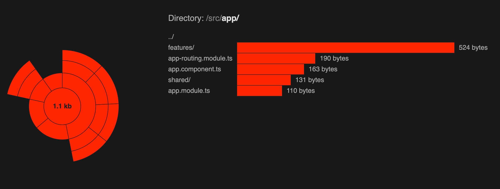
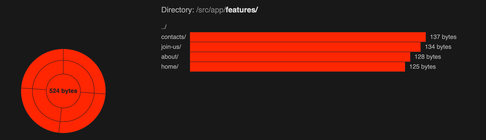
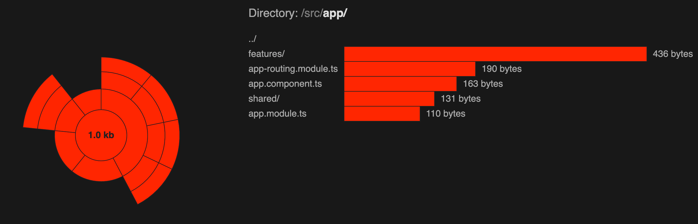
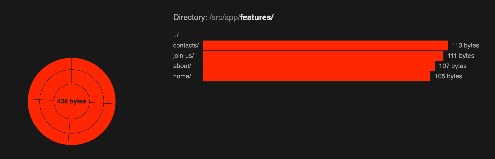

# Components Without Selectors

## TL;DR


```admonish note
Removing selector on component which are directly used by angular router
Angular will render a component without selector like this
<router-outlet><ng-component>....</ng-component></router-outlet> 
```


### Project Structure
```javascript
const routes: Routes = [
  {
    path: '',
    component : HomeComponent
  },
  {
    path: 'about',
    component : AboutComponent
  },
  {
    path: 'contacts',
    component : ContactsComponent
  },
  {
    path: 'join-us',
    component : JoinUsComponent
  }
];
```

## Before We Begin
```admonish note
To follow along, 
- Clone the project from [GitHub](https://github.com/jdansomon/angular-Components-Without-Selectors.git) `git clone https://github.com/jdansomon/angular-Components-Without-Selectors.git`
- Run `npm install` 
- Switch to the `composent-with-selectors` branch using `git checkout composent-with-selectors`.
```

## Results

### - Components with Selectors
```typescript
@Component({
  selector: 'app-home',
  templateUrl: './home.component.html',
  styleUrls: ['./home.component.scss']
})

@Component({
  selector: 'app-about',
  templateUrl: './about.component.html',
  styleUrls: ['./about.component.scss']
})

@Component({
  selector: 'app-contacts',
  templateUrl: './contacts.component.html',
  styleUrls: ['./contacts.component.scss']
})

@Component({
  selector: 'app-join-us',
  templateUrl: './join-us.component.html',
  styleUrls: ['./join-us.component.scss']
})
```
**Webpack Build Size:**

 

```admonish note
- The build size is 241.61 KB.
- when navigate to home page, the home component is loaded with the selector <app-home></app-home> in the DOM.
```


### - Components Without Selectors
```typescript
@Component({
  templateUrl: './home.component.html',
  styleUrls: ['./home.component.scss']
})

@Component({
  templateUrl: './about.component.html',
  styleUrls: ['./about.component.scss']
})

@Component({
  templateUrl: './contacts.component.html',
  styleUrls: ['./contacts.component.scss']
})

@Component({
  templateUrl: './join-us.component.html',
  styleUrls: ['./join-us.component.scss']
})
```
 

```admonish note
- The build size is 222.54 KB.
- when navigate to home page, the home component is loaded without the selector <app-home></app-home> in the DOM but it loaded with `<ng-component></ng-component>`.
```


## Angular 17+ ( esbuild ) 


```admonish note
- Esbuild is the next generation compilation and rendering pipeline.
```
### Components with Selectors

 



### Components without Selectors
 



### Summary

_**Angular 16**_
```admonish note 
1. [ ] The build size is 241.61 KB with selectors and 222.54 KB without selectors 
1. [ ] The build size is 19.07 KB less without selectors.
```

_**Angular 17 Esbuild**_
```admonish note 
1. The build size is 524 bytes with selectors and 436 bytes without selectors
1. The build size is 88 bytes less without selectors.
```

_**Angular 18 Esbuild**_
```admonish note 
1. The build size is XXX bytes with selectors and 436 bytes without selectors
1. The build size is XX bytes less without selectors.
1. The build size is XX.XX% less without selectors.
```

