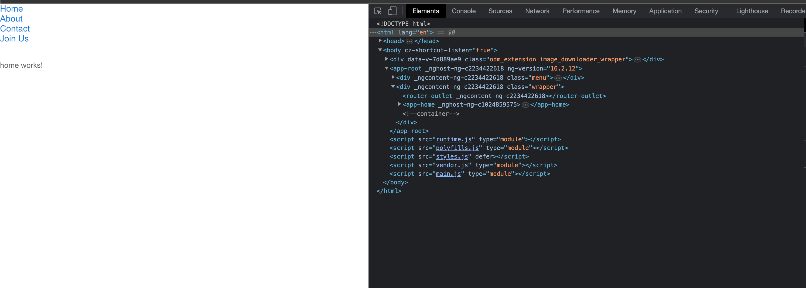

# Unleashing Angular's Power: Components Without Selectors

## Dive into Versatility and Efficiency

### Introduction
Embark on a transformative journey in Angular development by embracing the art of crafting components without selectors. Join us as we explore the unparalleled versatility of this approach, elevating the way you build dynamic applications with seamless routes.

### Project Overview

Before we dive into the technical details, let's take a quick look at the project structure and its components.

#### Project Structure
```plaintext
/ Components Without Selectors
|-- src
|   |-- app
|       |-- app.component.ts
|       |-- app.module.ts
|       |-- app-routing.module.ts
|       |-- features
|       |   |-- app-about
|       |   |   |-- app-about.component.ts
|       |   |   |-- app-about.component.html
|       |   |   |-- app-about.component.scss
|       |   |-- app-home
|       |   |   |-- app-home.component.ts
|       |   |   |-- app-home.component.html
|       |   |   |-- app-home.component.scss
|       |   |-- app-contacts
|       |   |   |-- app-contacts.component.ts
|       |   |   |-- app-contacts.component.html
|       |   |   |-- app-contacts.component.scss
|-- ...
```

### Before We Begin
To follow along, clone the project from [GitHub]() and set it up effortlessly. Run `npm install` and switch to the `composent-with-selectors` branch using `git checkout composent-with-selectors`.

### Components with Selectors
Now that we're familiar with the project structure, let's explore components with selectors, dissecting their impact on Webpack build size.

**Webpack Build Size:**


**Results:**


- Meet the dynamic duo: `app-root` and `app-home`.
- `app-root` takes the lead as the root component.
- Enter the welcoming realm of `app-home`.

### Components Without Selectors
Now, with a clear understanding of the project structure, let's delve into the revolutionary approach of creating components without selectors. Witness the magic unfold as we explore Webpack build size dynamics.

**Webpack Build Size:**


**Results:**


### The Sweet Spot: Why Components Without Selectors?
1. **Slimmer Build Size:** Experience a leaner application footprint, optimized for seamless performance. 

2. **Flexibility Unleashed:** Dive into the world of route navigation and dynamic components with a flexible and dynamic architecture.

### In Conclusion
This article has demystified the art of creating Angular components without selectors. From the advantages of reduced build size to the enhanced adaptability for dynamic components and routes, it's a game-changer in Angular development. Elevate your projects with efficiency and versatility – welcome to the era of components without selectors!